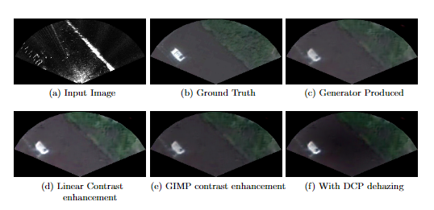

# SONAR to Satellite translation
This repository contains my work for the research project under Dr Amitesh Singh Rajput on translating SONAR Images to Satellite Images. This is an ongoing research project with more to come.

# Architecture

# Comparision of Generated images

# Comparision on Edge Detection

